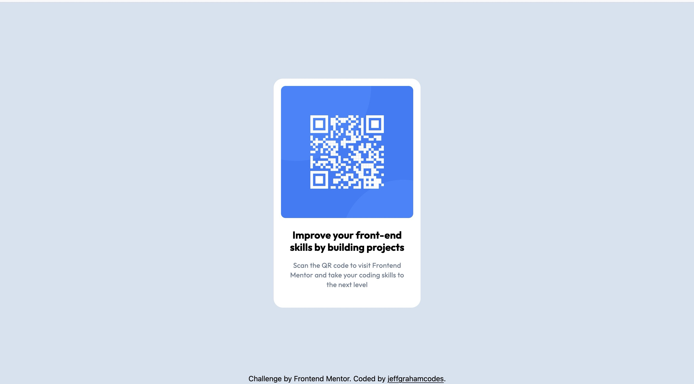

# Frontend Mentor - QR code component solution

This is a solution to the [QR code component challenge on Frontend Mentor](https://www.frontendmentor.io/challenges/qr-code-component-iux_sIO_H). Frontend Mentor challenges help you improve your coding skills by building realistic projects.

## Table of contents

- [Overview](#overview)
  - [Screenshot](#screenshot)
  - [Links](#links)
- [My process](#my-process)
  - [Built with](#built-with)
  - [What I learned](#what-i-learned)
  - [Continued development](#continued-development)
  - [Useful resources](#useful-resources)
- [Author](#author)

## Overview

### Screenshot



### Links

- Solution URL: [Github Repo](https://github.com/jeffgrahamcodes/qr-code)
- Live Site URL: [https://qr-code-two-zeta.vercel.app/](https://qr-code-two-zeta.vercel.app/)

## My process

### Built with

- Semantic HTML5 markup
- [Tailwind](https://tailwindcss.com/) - CSS Framework
- Custom CSS variables for color and spacing

### What I learned

This project helped reinforce the importance of semantic HTML for accessibility. I transitioned from basic `div` tags to more meaningful semantic elements like `<main>`, `<article>`, `<section>`, `<figure>`, `<header>`, and `<footer>`. I also learned how to:

- Center content using Tailwind’s flex utilities
- Create reusable utility classes using CSS variables
- Resolve accessibility warnings by adding landmarks and using semantic structure
- Improve the visual layout using Tailwind's spacing, sizing, and shadow classes
- Structure my project better by organizing assets and source files into a `src` folder

Here’s an example of a section I’m proud of:

```html
<main class="h-screen flex flex-col justify-center items-center">
  <article class="...">
    <figure>
      
    </figure>
    <section class="...">
      <header>
        <h1>Improve your front-end skills by building projects</h1>
        <p>
          Scan the QR code to visit Frontend Mentor and take your
          coding skills to the next level
        </p>
      </header>
    </section>
  </article>
</main>
```

### Continued development

I want to continue refining my use of semantic HTML and accessibility best practices. I’m also interested in learning how to integrate automated accessibility testing tools earlier in the development process.

### Useful resources

- [HTML Semantics Cheat Sheet](https://learntheweb.courses/topics/html-semantics-cheat-sheet/) - This helped get rid of the warnings from the accessibility report.
- [Tailwind Cheat Sheet](https://nerdcave.com/tailwind-cheat-sheet) - Cheat sheet to quickly find Tailwind class names and CSS properties .

## Author

- Website - [jeffgraham.codes](https://www.jeffgraham.codes)
- Frontend Mentor - [@jeffgrahamcodes](https://www.frontendmentor.io/profile/jeffgrahamcodes)
- Bluesky - [@jeffgrahamcodes.bsky.social](https://bsky.app/profile/jeffgrahamcodes.bsky.social)
